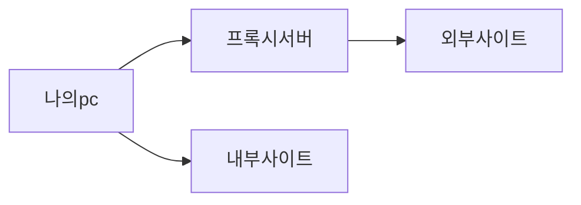

#### 사내 프록시 서버 알아보기!
---
사내에서 여러가지 정보들을 지키거나 보안적인 이유로 프록시 서버를 사용하는 경우가 있다!
우리 회사도 그렇다! 그래서 뭐만 하려고 하면 잘 안되는데 이때 프록시를 이해하고 있다면 조금은 빠르게 문제를 해결 할 수 있다! 
프록시는 한마디로 나 (Client) 와 접근하고자 하는 리소스 사이에 중개 역할을 한다.

예를들어 내가 사내에서 www.naver.com 에 들어가고 싶다고 해보자 그럼 이걸 바로 가지 않고 프록시 서버를 통해서 www.naver.com 를 간다는 것이다!

#### 프록시 서버는 왜 쓰는거야 ??
---
여러가지 이유가 있다!
1. 보안 강화 : 우리와 리소스가 직접 연결되어있지 않기에 보안이 강화된다!
2. 트래픽 제어 가능 : 프록시 서버에서 모든 네트워크를 관장하기에 내가 뭐하는지 알 수 있다!
3. 익명성 제공: 프록시 서버는 우리를 가려 줄수 있다!
그리고 회사에서 사용하는 이유는 아니지만 아래와 같이 성능적인 측면에서도 도움을 줄 수 있다
1. 캐싱 기능: 자주 접근 하는 웹사이트 정보를 캐싱 하여 성능을 증가 시킬수 있다!

#### 사내에서 문제가 되는 경우는 ?
---
python package 다운로드, docker image 다운로드, apt get install 등이 안되는 경우가 정말 많다... 이럴때는 프록시를 항상 의심해 보아야한다. 대부분의 SW는 프록시를 탈 수 있도록 설정이 가능하다. 그래서 구글에 `python package proxy` 처럼 검색은 한 다음 proxy 서버 정보를 입력하면 된다.

#### 사내에서 사내끼리의 네트워크는 ?
---
사내에서 사내는 프록시 서버를 경유하지 않는다. 그래서 no proxy 라는 것을 설정해 주어야한다. 사내에 SW 인프라가 많이 구축이 되어있다면 그 인프라를 직접 사용하는 경우가 있을것이다. 그때는 해당인프라의 ip 혹은 dns 주소를 no proxy 에 설정을 꼭 해주어야 한다.

여기까지 정리하면 아래의 그림과 같다!

