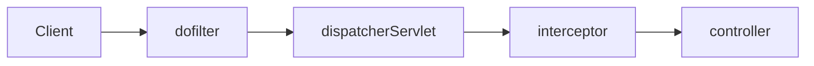

#### spring 에서 filter 와 interceptor 는 무슨 차이인가요?
---
Spring 에는 dofilter 라는 것이 존재한다. interceptor 와 유사하지만 약간의 차이점이 있다.


(dispatcherServlet 부터 Spring 내부라고 생각을 하면 된다.)

**필터**는 우선! 말 그대로 요청과 응답을 거르는 역할을 한다! spring 에 들어오기 전부터 실행이 될 수 있다!!

**interceptor** 는 dispatcherServlet 이 Controller 에 요청을 보내기 전과 후에 불러서 사용 할 수가 있다
표로 정리하면 아래와 같다!

|                   | Filter                                             | Interceptor                                               |
| ----------------- | -------------------------------------------------- | --------------------------------------------------------- |
| 관리              | servlet container                                  | spring container                                          |
| req,res 조작 가능 | O                                                  | X                                                         |
| 용도              | 인증, 모든것 로깅, spring과 분리되어야 하는 기능들 | Controller 로 넘겨 주려는 정보 가공, API 호출에 대한 로깅 |

#### dofilterInternal 사용하기
---

아래 처럼 간단한 authCheck 를 진행하고 바로 spring 으로 들어오기 전에 error 를 보낼 수 있다.
아무런 에러가 없다면 `filterChain.doFilter(request, response);` 으로 원래 하려던 대로 dispatcherServlet 으로 보내준다

```java
public class CustomFilter extends OncePerRequestFilter  {
    @Override
    protected void doFilterInternal(HttpServletRequest request, HttpServletResponse response, FilterChain filterChain)
            throws ServletException, IOException {
        try {
            if (!authCheck(request)) {
                response.sendError(HttpServletResponse.SC_UNAUTHORIZED, "Unauthorized");
                return;
            }
            filterChain.doFilter(request, response); // dispatcherServlet 로 넘어감
        } catch (Exception e) {
            response.sendError(HttpServletResponse.SC_INTERNAL_SERVER_ERROR, "Internal Server Error");
            e.printStackTrace();
        }
    }
}
```