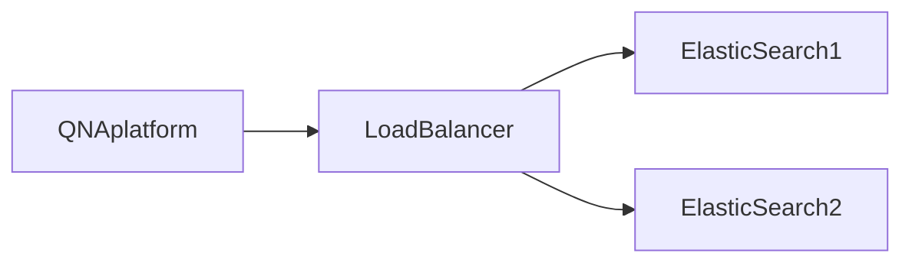

#### ElasticSearch Cluster 구성하기
---
검색 시스템 개선을 위해서 Elastic Search 를 구성해야하는 일이 생겼다. Elastic Search 를 구성하는걸 찾아보다보니 단일 노드로 구성하는 것이 아닌 여러개를 띄워서 구성을 하는 것이 안정적이라고 하여 2개의 cluster 를 구성하기로 했다. 

Elastic Search Cluster 는 둘다 같은 정보를 가지고 있고 요청은 한곳으로 하지만 쓰여지는 곳은 둘다 읽을때는 한곳만 이런식으로 작동을 한다.

따라서 생각해본 구조도는 다음과 같다.



#### 우선은 하나만 띄워보자!
---
우선 Elastic Search image 를 가져왔다 docker search 를 사용하면 elastic Search 가 있다. 다운 받아준 다음에 다음과 같이 실행한다
```bash
docker run -d --name elastic-search-ev -e discovery.type=single-node -p 8080:9200 -p 50004:9300 elasticsearch:x.x.x
```

9200 은 실제로 elastic search 에 우리가 요청하는 포트이고 9300 은 elastic search 를 cluster 로 연결했을때 사용되는 포트이다!
#### 혹시 이런 에러가 발생했다면?
---
```bash
bootstrap checks failed
max virtual memory areas vm.max_map_count [] is too low
```

라는 에러가 발생했다면
```bash
vim .etc/sysctl.conf
vm.max_map_cunt = 2621426
```
을 설정해준뒤
```bash
sysctl -p
```
해주면 된다!

#### 이제 여러개를 띄워보자! 
#### Elastic Search CA Util
elastic Search 는 Cluster 를 구성하기위해서는 무조건 https 로 띄워져야한다. 따라서 elastic Search 내부에 cautil 이라는 실행파일이 있어서 손쉽게 crt 파일을 만들수가 있다.

우선 아래처럼 instances.yml 을 만들어 준다. 이때 name은 container name 과 맞춰서 해주면 보기에 편하고 잘 동작한다.
```yaml
instances:
	- name: es01-dev
		dns : 
			- es01-dev
		ip :
			- 10.166.238.55
	- name: es02-dev
		dns : 
			- es02-dev
		ip :
			- 10.166.238.63	
```

만들어 주고 docker container 안으로 넣는다! 그리고 docker exec 로 안에 들어간 다음
```bash
bin/elasticsearch-certutil ca --days 730
bin/elasticsearch-certutil cert --slient --in config/instance.yml --out certs.zip --ca elastic-stack-ca.p12 --days 730
```
그러면 certs.zip 이 나오는데 압축 풀고 docker-compose 를 통해 p12 파일을 각각 넣어준다!

container name 은 아까 말했든 instance.yml 과 맞춰주어야한다. 그리고 아까 만든 p12 파일을 넣어준다.
es01-dev 의 docker-compose.yml 파일은 아래와 같다!
```yaml
version: '3'
services:
  elasticsearch:
    image: docker.elastic.co/elasticsearch/elasticsearch:x.x.x
    container_name: es01-dev
    environment:    
		- node.name=es01-dev
		- cluster.name=docker-cluster-dev
		- discovery.seed_hosts=es02-dev (상대방들)
		- cluster.initial_master_nodes=es01-dev,es02-dev
		- bootstrap.memory_lock=true
		- ES_JAVA_OPTS=-Xms512m -Xmx512m
		- xpack.security.transport.ssl.enabled=true
		- xpack.security.http.ssl.enabled
		- xpack.security.enabled
		- xpack.security.http.ssl.keystore.path={압축 풀었을떄 es01-dev.p12위치}
		- xpack.security.transport.ssl.keystore={압축 풀었을떄 es01-dev.p12위치}
		- xpack.security.transport.ssl.truststore.path={es01-dev.p12위치}
		- discovery.seed_hosts=x.x.x.64 (상대방)
		- network.publish_hosts=x.x.x.55 (나)
		- ELASTIC_PASSWORD=1234
	volumes:
      - {p12 파일 마운트}
    ports:
      - "9200:9200"
      - "9300:9300"
    networks:
      - elastic-dev

networks:
	elastic-dev
		driver: bridge
```

es02-dev 의 dockercompose도 비슷하게 작성해주면 된다!
```yaml
version: '3'
services:
  elasticsearch:
    image: docker.elastic.co/elasticsearch/elasticsearch:x.x.x
    container_name: es02-dev
    environment:    
		- node.name=es02-dev
		- cluster.name=docker-cluster-dev
		- discovery.seed_hosts=es01-dev (상대방들)
		- cluster.initial_master_nodes=es01-dev,es02-dev
		- bootstrap.memory_lock=true
		- ES_JAVA_OPTS=-Xms512m -Xmx512m
		- xpack.security.transport.ssl.enabled=true
		- xpack.security.http.ssl.enabled
		- xpack.security.enabled
		- xpack.security.http.ssl.keystore.path={압축 풀었을떄 es02-dev.p12위치}
		- xpack.security.transport.ssl.keystore={압축 풀었을떄 es02-dev.p12위치}
		- xpack.security.transport.ssl.truststore.path={es02-dev.p12위치}
		- discovery.seed_hosts=x.x.x.55 (상대방)
		- network.publish_hosts=x.x.x.64 (나)
		- ELASTIC_PASSWORD=1234
	volumes:
      - {p12 파일 마운트}
    ports:
      - "9200:9200"
      - "9300:9300"
```

이렇게 두개를 띄우면 cluster 가 완성될때까지 기다리다가 완성이 되면 제대로 동작을 한다!!
제일 앞에 Load Balancer 를 두어 한번은 es01에 한번은 es02 로 request 가도록 하였다!