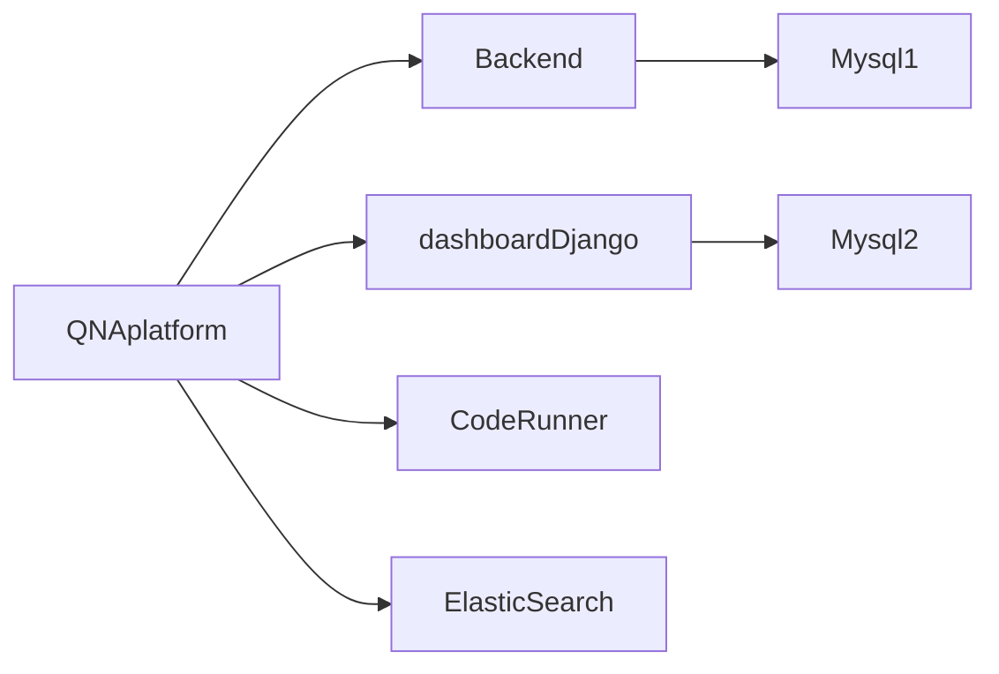

#### HealthCheck 구축
---
원래 우리는 따로 linux workstation 에 띄워놓은 uptime kuma (https://github.com/louislam/uptime-kuma) 를 사용하여 우리 시스템의 health check 를 하고 있었다.
이 시스템도 좋았지만 사내 메신저로 알림을 주지 못하고 MMS 연동이 되어있지 않았기에 이번에 사내에 o11y 를 지원하는 새로운 플랫폼이 생겨서 그쪽을 새롭게 사용해 보기로 했다.

우리 플랫폼의 구조는 다음과 같다. 

모든 친구들의 건강을 체크하고 싶었다 우선 http 와 tcp healthcheck 를 나누었다.
Mysql 이 아닌 모든것은 http healthcheck 로
구축 할 수 있었고 제일 main page 를 2분에 1번씩 Request 하도록 했다.
2개의 Mysql DB 는 tcp 통신으로 healthcheck 를 하도록 했다.
운영 서버뿐만 아니라 똑같이 Stage 서버도 구축을 하였다.
이제는 우리 QnA 플랫폼이 무사한지 자리 가서 확인해야하고 이렇지 않아도 되어 정말 다행인거 같다..