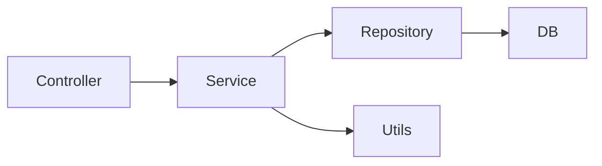

#### Spring 프로젝트를 진행 할 때 되도록이면 지키면 좋은 구조!
---
최근에 우리 Q&A 플랫폼의 대대적인 리팩토링을 진행하면서 마음에 담아두고 있어야 하는데 점점 잊어 갔던것만 같은 구조의 중요성에 대해 또 한번 뼈저리게 느끼게 되었다.

우선 Spring 은 Controller 가 있다. Controller 는 오직 model 혹은 response에 넣어 줄 정보만 넣어주는 역할을 하면 된다.

그 넣어줄 여러가지 정보는 Service 에게서 받아야한다. 복잡한 로직, 비즈니스 로직같은 것은 Service에서 처리를 한다. 여러개의 Service에서 사용하는 공통된 Utils의 경우는 하나로 모은다. Service 에서 데이터를 가공하는 과정에서 DB와의 통신을 해야하는데 그것은 Repository를 사용한다.

Repository는 DB과 이야기하는 역할을 한다. Controller 그리고 Service에서는 DTO를 통해서 데이터를 주고 받았다면 여기에서는 Entity를 사용해서 직접 DB에 적고 읽고 업데이트 한다.

이렇게 되면 선형적인 구조가 되면서 유지보수가 쉬워진다... 알면서 알면서 계속 개발해 나가다보면 잊게 된단 말이지... 그에대한 업보를 지금 청산하는 기분이다!!

#### 그래프로 확인해보면?
---
그래프로 정리하면 다음과 같다!

사실 정답은 없는것이지만! 최대한 이러한 구조를 유지하면서 만들고 있는 나만의 프로젝트다!
https://github.com/bwbw-kim/bus-station