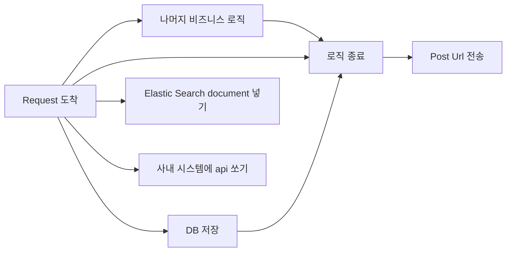

#### Post 요청이 너무 늦게 끝난다
---
SW Q&A 플랫폼에서 글을 올릴때 submit이 되고 post request 의 모든 동작이 끝나고 방금 올린 글의 url로 이동하는 동작이 있다. 그런데 그 동작내부에 조금씩 조금씩 로직이 추가되다보니 시간이 꽤 걸리게 되었다.

대략적으로 시간이 오래걸리는 작업의 플로우는 아래와 같았다.


따라서 요것들을 기능단위로 parallel하게 해버릴 필요가 있었다.
Elastic Search, 사내 시스템 API처럼 리턴값을 받을 필요가 없는 것들은 예전에 했던 completableFuture로 parallel 하게 해버리고 DB저장은 꼭 저장이 되어야 그 post url 로 이동할수 있기때문에 기다려야했다.

#### Thread로 사용하고 기다리기
---
```java
Thread thread = new Thread(() -> /*저장하는 로직*/);
thread.start();
// 나머지 로직들 실행
try {
	thread.join();
} catch (InterruptedException e) { }
```

이렇게 해주면 thread.join() 에서 기다릴수 있다. 그래서 디비에 저장은 기다리되 의존성없는 다른 로직은 계속 실행되도록하고 저장이 완료가 되면 리턴!


#### 변경된 플로우
---

따라서 변경된 플로우는 아래와 같다!



정말 훨씬 훨씬 빨라져서 이제 사용자들이 보다 쾌적하게 글을 올리고 답변을 작성 할 수 있게 되었다