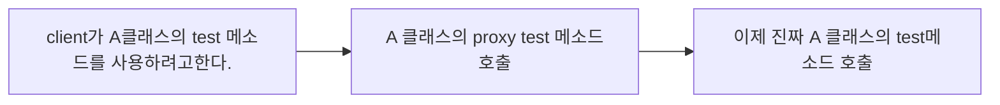

#### Spring transactional 를 사용하면 변화하는 점
---
스프링에서 Transactional은 저번에도 공유했지만 atomic하게 하기위해 필요한 annotation이다!
하지만 원하는 method의 위에다가 적는다고 해서 무조건 해주는 것은 아니다!

우선 이것을 이해하기위해서는 Spring의 proxy에 대해 조금 알아볼 필요가 있다!

Spring의 bean에 등록이된 객체안에 어느 하나라도 transactional이 붙게되면 Spring에서는 그 객체의 proxy를 만들어 버린다! 따라서 아래와 같이 변화하게 된다



그럼 이제 proxy test에서 begin 과 commit으로 진짜 test를 감싸는 방식으로 atomic을 구현한다.

하지만 proxy를 거치는 것은 외부 클래스에서 내부로 들어올때만 거치게 된다!

이러한 특성때문에 몇가지 주의할 점이 생긴다!

#### 주의 할 점?
---
1. Bean 에 등록된 객체만 사용가능하므로 그냥 객체에 사용하면 의미가 없다!
2. new로 만들어진 객체는 Bean에 등록이 안되었으므로 사용해도 의미가 없다!
3.  우선 proxy도 외부에서 클래스를 참조하여 생기는 것이기때문에 private method는 transactional이 의미가 전혀 없다!
4. 같은 class내의 transactional 메소드를 부르면 proxy를 타지 않기때문에 atomic을 보장 할 수 없다! 그러니까 아래의 코드에서 methodB를 통하면 atomic하지 않고 methodA를 외부에서 바로 불러야 transactional을 사용 할 수 있다!


```
class A {
	@Transactional
	void methodA() {
	}
	void methodB() {
		methodA()
	}
}
```