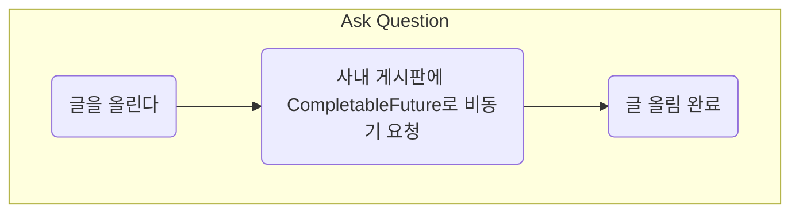

#### CompletableFuture 사용하다가 어느 시점부터 코드가 진행이 안된다면?
---
SW Q&A 플랫폼에서 질문을 게시할 때 다음과 같이 진행하는 부분이 있다.


사내 게시판에 요청을 보내는 것은 전혀 질문을 게시하는것과는 따로 움직이게 되고 또 네트워크성능에 따라 오래 걸릴수도 있는 작업이기 때문에 비동기를 진행을 하고 있었다. 코드는 아래와 같이 사용하고 있다.

```java
public CompletableFuture<String> createPost (Post post) {
	return CompletableFuture.supplyAsync(() -> {
		return requestPost(CONF.externalURL(), createBody(post));
	});
}


...


myclass.createPost(post);
```

#### 그런데 어느 순간부터 requestPost 안으로 코드가 진행이 되지 않았다
---
어느 순간부터 requestPost 안으로 코드가 진입을 하지 않았다. 처음에는 쓰레드개수가 부족하거나 어딘가에서 interrupt 하는것은 아닌가를 의심했었는데 그곳에는 문제가 없었다. 따라서 코드를 한줄 한줄 따라가다보니 createBody 안에서 exception이 발생해서 더이상 코드가 진행되지 않았던 것이다! 그런데 왜! 에러메시지가 나오지 않앗따!

#### CompletableFuture 는 join 하지 않으면 에러메시지가 나오지 않는다.
---
```java
CompletableFuture<String> res = myclass.createPost(post);
res.join()
```
res가 들어오기까지 기다려주는 join을 작성해주면 바로 에러 메시지를 만날 수 가 있다.

completableFuture는 join 전까지는 exception msg를 띄워주지 않는다!

혹시 갑자기 CompletableFuture안에서 코드 진행이 멈춘다면 한번 에러가 있지는 않은지 확인해보거나 꼭 join을 해주자!
