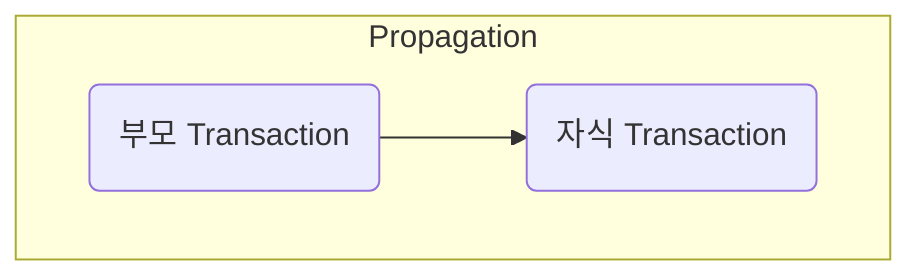
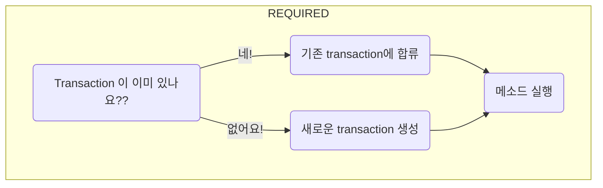

#### Transactional 의 propagation 옵션은 뭘까?
---
transactional를 붙이면서 개발하다보면 간혹 Transactional 이 Transactional을 부르는 경우가 있을 수 있다! 그럼 그때는 어떻게 동작할까? 에 대한 정보가 바로 propagation이다!

나를 부른 부모가 transaction이 있는가 없는가를 보고 내가 (자식이) 어떻게 행동할지를 옵션으로 정한다고 생각하면 된다!

간단하게 그림을 그려보면 다음과 같다!


그럼 여기에서 몇가지 생각이 든다. 과연 먼저 부모 Transaction이랑 이어서가야하는가 아니면 자식 Transaction 은 따로 가야하는가! 물론 다양한 경우가 커버 되어있다! 오늘은 그것에 대해 알아보겠다!

#### Required 와 Requires_new 비교해보기
---
가장 기본이 되는것의 위의 2가지이다! 
##### Required (기본값이다!)
Required는 부모 Transaction이 있다면 자식 Transaction 에서는 추가로 생성하지 않고 부모를 따라간다. 부모가 Transaction이 아니라면 본인만의 Transaction 을 연다!

이렇게 되면 자식 Transaction이 error로 abort되어야하면 부모 Transaction도 같이 따라서 roll back이 되어버린다!



##### Requires_new

Requires_new는 부모 Transaction 이 있든 없든 본인만의 새로운 Transaction을 열어버린다. 즉 2개의 Transaction 처럼 동작을 한다. 실제로는 DB 와의 커넥션을 1개를 또 열어 따로 Transaction을 만들고 실행한다!

이렇게 되면 자식 Transaction이 error로 abort 되어도 부모 Transaction은 신경쓰지 않고 계속해서 진행이 된다.


#### 그 이외의 propagation option
---
다른 propagation도 있다! 
1. supports
	- 트랜잭션이 있으면 참여하고, 없으면 트랜잭션 없이 실행된다!
2. not_support
	- 트랜잭션이 있더라도 이순간 만큼은 트랜잭션 없이 실행된다!
3. mandatory
	- 트랜잭션이 이미 존재했어야하며 만약 없다면 Exception!
4. never 
	- 트랜잭션이 없었어야하며 만약 있다면 Exception!

#### 사용 방법
---
아래처럼 간단하게 사용이 가능하다!

```java
...
@Transactional(propagation = Propagation.REQUIRES_NEW)
public void childMethod() {
    // 자식
}
```
